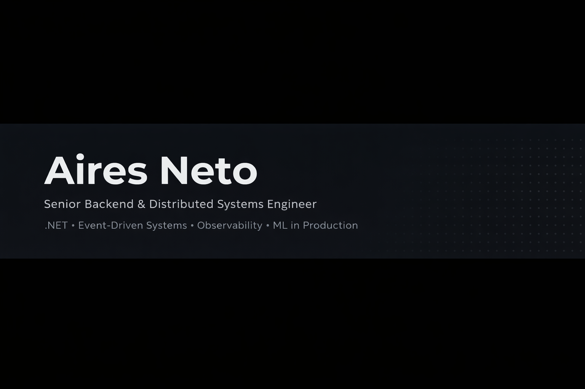

  

---

## 👋 Hi, I'm Aires

Senior Backend & Distributed Systems Engineer focused on building observable, resilient systems in production.

I design systems that:

- Fail safely  
- Ship incrementally  
- Are measurable by default  
- Evolve without fear  

My work spans event-driven architecture, ML systems in production, and full-stack delivery — but always with operability and reliability at the core.

---

## Engineering Philosophy

- Design for operability, not just correctness  
- Ship safely using progressive rollout strategies  
- Make trade-offs explicit  
- Prefer simple systems with strong observability  
- Treat ML systems as production software, not experiments  

---

## 🏗 Featured Systems

### 🔹 ML Observable Prediction Platform
Production-ready ML system with:
- Shadow traffic rollout
- Drift monitoring
- Kill-switch mechanisms
- Full tracing and metrics

Designed to treat ML as production software — not experimentation.

### 🔹 .NET Observability API
ASP.NET Core API instrumented with:
- OpenTelemetry tracing
- Prometheus metrics
- Grafana dashboards
- Structured logging

Built to demonstrate production-grade observability from day one.

### 🔹 Event-Driven Microservices System
RabbitMQ-based architecture implementing:
- Transactional outbox
- Idempotent consumers
- Retry and backoff strategies
- Distributed observability

---

## GitHub Activity

I keep this profile focused on production-quality projects and documentation.  
For the most important work, see the pinned repositories above.

---

## Core Stack

### Backend & APIs

### Messaging

### Observability

### Cloud & DevOps

---

  

---

## Connect

- LinkedIn: https://linkedin.com/in/aires-neto-2750b2b0  
- GitHub: https://github.com/aneto-dev
